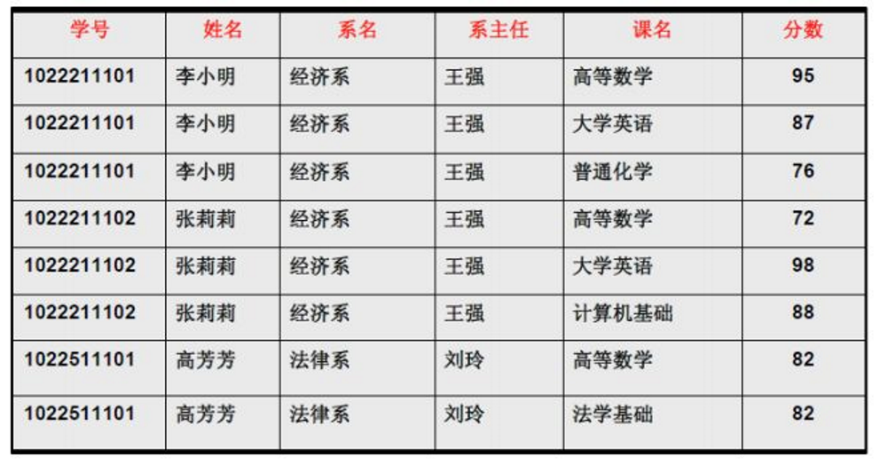
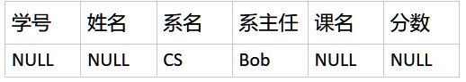

# 数据库范式

## TODO List

- [√]1ND概念，1ND例子
- []2ND概念，2ND
- []3ND概念，3ND例子，2ND如何分解得到3ND
- []4ND

下面的内容主要来自于课本，互联网资料的整合，在一些难理解的概念处，我加上了自己的白话理解。关于属于第几范式的判断，也有一个逐步骤分析的例子。

范式表示一个关系内部各属性之间联系的合理化程度。可以用来表示一个关系结构所符合设计标准的级别。举个并不恰当的例子，比如建筑装饰里面，不同的工程类别需要不同的等级，等级高了，材料的要求就高，越环保，当然，施工难度和成本就更大。范式可以分为5个级别，分别为1ND，2ND，3ND，BCND，4ND，相对而言，低级别的范式都更加粗糙，高级别的范式则更精致。高级别的范式一定满足低级别的范式，低级别的范式一般都难以满足高级别范式的要求。

## 1ND

最低级别的自然是1ND，只要关系内部的各个属性都是不可再分的，那么就符合第一范式。但仅仅符合1ND是绝对不够的，对于下表



可能出现这些问题：

1. 数据冗余：姓名，系名，系主任重复了多次
1. 插入异常：下面表内的候选码很容易确定是学号和课程名，也必须这样才能唯一确定一个元组，即当候选码确定后，该表中的其他属性也都随之确定了。一个关系可能有多个候选码，任取一个候选码（这里仅有一个）作为关系的主码（或者叫码），码一定具有实体完整性，即非NULL，唯一，不满足实体完整性便拒绝插入



1. 数据冗余：姓名，系名，系主任重复了多次

## 2ND

第二范式要求关系中非主属性对于码没有部分函数依赖

这里需要解释一组概念了：

函数依赖又可以进一步分为直接函数依赖，传递函数依赖。直接函数依赖可以分为完全函数依赖于部分函数依赖。

- 函数依赖
	- 直接函数依赖
		- 完全函数依赖
		- 部分函数依赖
	- 传递函数依赖

### 函数依赖

`R(U)`是属性集`U`上的关系模式，`X`、`Y`为`U`的子集，对
于`R(U)`的任何一个关系实例，不存在两个元组在`X`上的属性相同，在`Y`上的属性值不同，就称为`X`决定`Y`，`Y`函数依赖于`X`，记为`X->Y`。

即在一张表内，某个属性或者属性组`X`确定后，`Y`就一定可以确定出来，类似于函数`Y=F(x)`，`X`是确定的，那么`Y`也一定可以明确得出，需要注意`X`,`Y`都是关系的属性或者属性组。

	

上表中的学号确定后，都可以随之确定姓名和班级，并非指一一对应，而是说同一个学号，绝不会对应两个不同的姓名或者班级，这便叫做姓名和班级依赖于学号，学号决定姓名与班级。记为`学号->{姓名,班级}`


### 候选码、主码、码、主属性、非主属性、全码

定义一个关系模式`R(U)`，`U`表示属于这个关系模式的所有属性的集合。

比如下面这个关系模式

```sql
学生(学号,姓名,班级,家庭住址,电话号码)
```

关系模式学生，它的所有属性的集合`U`就是

```sql
u = {学号,姓名,班级,家庭住址,电话号码}
```

有了以上定义，我们就可以开始了。

#### 候选码

如果一个关系内部，有某个属性或者属性组，可以唯一表示它坐在的元组，而它的子集不能，称这个属性或者属性组为**候选码**。

如何在复杂的关系中一个不拉的确定候选码是非常重要的一步骤，一会儿来说，先掌握候选码的概念。

#### 主码

一个关系中的候选码可以有多个，任选其中之一，称其为**主码**。

#### 主属性与非主属性

一个关系可能有多个候选码，只要在这些候选码中的属性都称为**主属性**。用`U`属性集合，减去主属性集合，剩余的就是**非主属性**了。

比如下面的例子


我试图解释的这个例子，仅仅有助于理解主属性和非主属性，前后衔接的话不一定是对的，后续说到与此处有关，能帮忙修正这个解释的概念时，我会特别说明。

在这里的学号是唯一的，自然它就是一个候选码了。再看看其他属性还能不能是候选码，在一个学校里面两个同学有相同的名字是很正常的，姓名属性一定不是候选码，班级和家庭住址（不排除双胞胎）也无法唯一确定一个学生。这里候选码就是学号。

用属性集合`U`去掉候选码内的属性，这里只有一个学号，剩余的属性集合`{姓名,班级,家庭住址}`就是非主属性。

#### 码

主码和候选码都可以简称为码，具体码的所指，需要看上下文。


### 完全函数依赖与部分函数依赖

`R(U)`为属性集`U`的关系模式，X决定Y，但对于X的任何一个真子集，都无法决定Y，将此时的函数依赖关系称为完全函数依赖。

`R(u)`

## 参考

- [解释一下关系数据库的第一第二第三范式？]	(https://www.zhihu.com/question/24696366)
